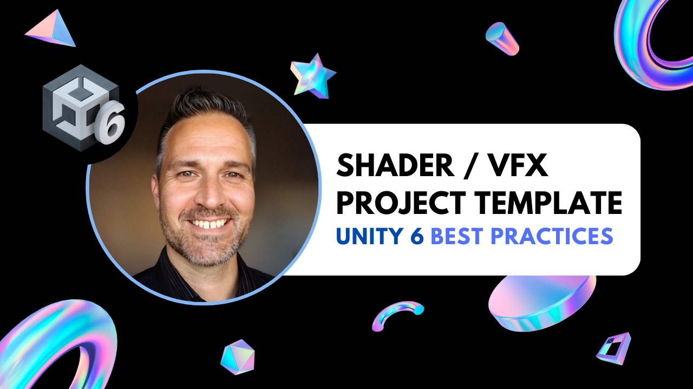
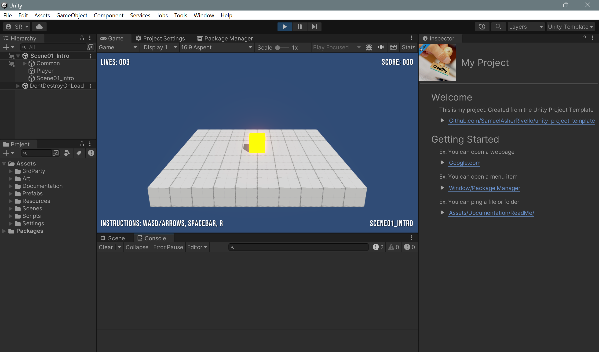

# Unity Project Template (ShaderGraph / VFXGraph)

 

This repo represents the ideal starting point for new Unity projects.

The project includes best practices for **project structure** and **C# coding standards** as well as packages for **ShaderGraph** and **VFXGraph**.

 

**Getting Started: Steps**
1. Download this repo (*.zip or *.git)
1. Download the [Unity Editor](https://store.unity.com/#plans-individual)
1. Open this repo in the Unity Editor
1. Enjoy

 

**Getting Started: Video**

 

## Table of Contents

1. [About](#about)
1. [Overview](#overview)
1. [Resources](#resources)
1. [Credits](#credits)

 

## About

### Template Basics

This template contains the following:

| Name                                                                                             | Description                                               |
|-------------------------------------------------------------------------------------------------|-----------------------------------------------------------|
| [Assembly Definitions](https://docs.unity3d.com/Manual/ScriptCompilationAssemblyDefinitionFiles.html) | Organize and optimize script compilation.                 |
| [Best Practices: Coding Standards](https://www.samuelasherrivello.com/best-practices)            | Guidelines for consistent code style and format.          |
| [Best Practices: Project Structure](https://www.samuelasherrivello.com/best-practices)           | Recommended project structure and organization.           |
| [Cinemachine](https://docs.unity3d.com/Packages/com.unity.cinemachine@latest)                    | Advanced camera system for dynamic shots.                 |
| [Physics](https://docs.unity3d.com/Manual/PhysicsSection.html)                                   | Physics simulation for 2D and 3D games.                   |
| [ProBuilder](https://docs.unity3d.com/Packages/com.unity.probuilder@latest)                      | 3D modeling and level design toolset.                     |
| [Rendering: Post-Processing](https://docs.unity3d.com/Packages/com.unity.postprocessing@latest)  | Visual effects like color grading and bloom.              |
| [Rendering: URP](https://docs.unity3d.com/Packages/com.unity.render-pipelines.universal@latest)  | Efficient rendering pipeline for various platforms.       |
| [Text Mesh Pro](https://docs.unity3d.com/Packages/com.unity.textmeshpro@latest)                  | High-quality text rendering and formatting.               |
| [Unit Testing](https://docs.unity3d.com/Packages/com.unity.test-framework@latest)                | Automated tests to verify code stability.                 |
| [Unit Testing: Code Coverage](https://docs.unity3d.com/Packages/com.unity.test-framework.codecoverage@latest) | Measure code tested during unit testing.                  |

### More Templates

If you want these template basics **plus** additional features, check out the following:

| Repository                                                                                         | Template Basics | AR  | VR  | Multiplayer | WebGPU | DOTS |
|---------------------------------------------------------------------------------------------------|-----------------|-----|-----|-------------|--------|------|
| [unity-project-template](https://github.com/SamuelAsherRivello/unity-project-template)             | ✅              | ❌  | ❌  | ❌          | ❌     | ❌   |
| [unity-project-template-ar](https://github.com/SamuelAsherRivello/unity-project-template-ar)       | ✅              | ✅  | ❌  | ❌          | ❌     | ❌   |
| [unity-project-template-vr](https://github.com/SamuelAsherRivello/unity-project-template-vr)       | ✅              | ❌  | ✅  | ❌          | ❌     | ❌   |
| [unity-project-template-coherence-multiplayer](https://github.com/SamuelAsherRivello/unity-project-template-coherence-multiplayer) | ✅              | ❌  | ❌  | ✅          | ❌     | ❌   |
| [unity-multiplayer-ngo-2d-playground](https://github.com/SamuelAsherRivello/unity-multiplayer-ngo-2d-playground) | ✅              | ❌  | ❌  | ✅          | ❌     | ❌   |
| [unity-project-template-webgpu](https://github.com/SamuelAsherRivello/unity-project-template-webgpu) | ✅              | ❌  | ❌  | ❌          | ✅     | ❌   |
| [rmc-dots-examples](https://github.com/SamuelAsherRivello/rmc-dots-examples)                       | ✅              | ❌  | ❌  | ❌          | ❌     | ✅   |

 
 

## Overview

### Features

This project is a living template. It showcases the best practices and coding standards for many common workflows.

### Structure

**Documentation**
* `ReadMe.md` - The primary documentation for this repo
* `Unity/Assets/Documentation/ReadMe.asset` - Select this asset in Unity to get started

**Configuration**
* `Unity Target` - [Standalone MAC/PC](https://support.unity.com/hc/en-us/articles/206336795-What-platforms-are-supported-by-Unity-)
* `Unity Version` - Use this [Version](./Unity/ProjectSettings/ProjectVersion.txt)
* `Unity Rendering` - [Universal Render Pipeline (URP)](https://docs.unity3d.com/Manual/universal-render-pipeline.html)
* `Unity Aspect Ratio` - [Game View 10x16](https://docs.unity3d.com/Manual/GameView.html)

**Structure**
* `Unity/` - Open this folder in the Unity Editor
* `Unity/Assets/Scenes/` - Open any Scene. Press 'Play'!

**Dependencies**
* `Various` - Already included via [Unity Package Manager](https://docs.unity3d.com/Manual/upm-ui.html) as this [Version](./Unity/Packages/manifest.json)

 
 

## Resources

Here are more articles from Samuel Asher Rivello.

**Portfolio**
* [SamuelAsherRivello.com/best-practices](https://www.SamuelAsherRivello.com/best-practices)
* [SamuelAsherRivello.com/rendering-portfolio](https://www.SamuelAsherRivello.com/rendering-portfolio)

**Medium**
* [Best Practices — 1 — Unity Project Structure](https://samuel-asher-rivello.medium.com/unity-project-structure-a694792cefed)
* [Best Practices — 2 — Unity C# Coding Standards](https://samuel-asher-rivello.medium.com/coding-standards-in-c-39aefee92db8)
* [Best Practices — 3 — Unity Overview](https://samuel-asher-rivello.medium.com/best-practices-3-unity-8abcce214ddc)
* [Best Practices — 4 — MVC Architecture For Unity](https://samuel-asher-rivello.medium.com/unleashing-the-power-of-mvc-architecture-in-unity-a-journey-of-structured-game-development-492ef9c53817)
* [Best Practices — 5 — Unit Testing For Unity](https://samuel-asher-rivello.medium.com/unity-testing-for-unity-elevating-your-game-development-skills-eb76fc0bbea3)

 
 

## Credits

**Created By**

- Samuel Asher Rivello
- Over 25 years XP with game development (2024)
- Over 11 years XP with Unity (2024)

**Contact**

- Twitter - <a href="https://twitter.com/srivello/">@srivello</a>
- Git - <a href="https://github.com/SamuelAsherRivello/">Github.com/SamuelAsherRivello</a>
- Resume & Portfolio - <a href="http://www.SamuelAsherRivello.com">SamuelAsherRivello.com</a>
- LinkedIn - <a href="https://Linkedin.com/in/SamuelAsherRivello">Linkedin.com/in/SamuelAsherRivello</a> <--- Say Hello! :)

**License**

Provided as-is under <a href="./LICENSE">MIT License</a> | Copyright ™ & © 2006 - 2024 Rivello Multimedia Consulting, LLC